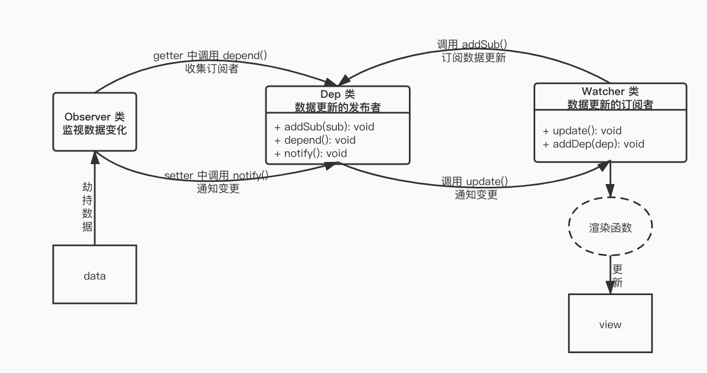
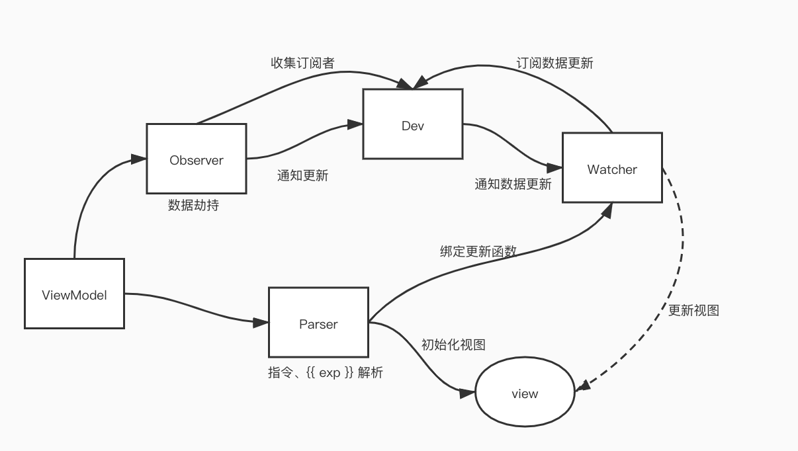

# 自定义 MVVM 库

## 概述

使用 Vue 有一段时间了，其响应式数据处理在很大程度上提高了项目编码效率，一直没有好好研究过其原理，趁最近疫情宅家的时间，研究整理并自定义了一个简单的 MVVM 库，算是加深对它的的理解吧。本库借鉴 Vue.js 2.x 版本相关原理，需要一定的 JavaScript 基础，文中如果遇到不理解的地方可自行查阅相关文档。

## 准备

### Vue 双向绑定原理

Vue 采用数据劫持加发布-订阅模式（有说观察者模式-有待细致研究其差异）实现响应式数据处理，通过 `Object.defineProperty()` 来劫持数据的 `getter/setter`，当数据更新时触发 `setter` 以更新视图。

### Object.defineProperty()

`Object.defineProperty()` 用于在一个对象上定义新的属性，或是修改已有属性，它是 ES5 中无法被 shim 的一个特性，所以不能在 IE9 之前的浏览器中使用。先看一个示例：

```js
// 判断 data 是否为对象
const isObject = data => (data !== null && typeof data === 'object')

// 劫持数据方法
const observe = data => {
  if (!isObject(data)) return
  
  // 拦截处理 data 各属性
  Object.keys(data).forEach(key => {
    observeProperty(data, key, data[key])
  })
}

// 修改对象现有属性，设置 getter/setter
const observeProperty = (obj, key, value) => {
  // value 可能也是对象，继续劫持
  observe(value)
  // 处理 getter/setter
  Object.defineProperty(obj, key, {
    configurable: true,
    enumerable: true,
    get() { // 获取属性值，如：stu.name
      return value
    },
    set(val) { // 设置属性值，如：stu.name = '张三'
      console.log('data changed: ', value, ' => ', val)
      value = val
    }
  })
}
```

上例仅是简单拦截普通对象，对数组暂时未做处理，简单测试一下：

```js
const stu = {
  id: 1,
  name: {
    first: '二',
    middle: '小',
    last: '王'
  }
}
observe(stu)
stu.id = 10
stu.name.last = '李'
console.log('修改后，id =', stu.id)
console.log('修改后，last =', stu.name.last)
```

运行结果打印如下：

```js
data changed:  1  =>  10
data changed:  王  =>  李
修改后，id = 10
修改后，last = 李
```

可以看到，当修改 `stu` 对象属性值时，会调用到对应属性的 `setter` 来更新数据，执行控制台输出。

### 跟踪变化

借用 Vue 官方给出的原理图，先来看一下：


数据的 `getter/setter` 对用户是不可见的，但在内部它们可以让 Vue 跟踪依赖，当 `getter` 被访问时，会对 Watcher（可理解为订阅者）收集依赖，当 `setter` 被访问时，会通知 Watcher 变更以触发重新渲染视图。当然 Vue 使用了虚拟 DOM 树结构，为简化自定义 MVVM 库，本文暂不实现虚拟 DOM。

通过 Vue 源码分析，其响应式数据处理主要集中在 Data 处理、Watcher 和 渲染函数（需要解析指令等）上，它们之间的关系更细致的为：



其中 `Observer` 类和 `Dep` 类并未在官方图中明示。

有了以上准备工作，下面来自定义一个简单的 MVVM 库。

## 思路

为更快的实现自定义 MVVM 库，先捋一下思路，思路清晰了，编码才能事半功倍。

MVVM 是在 View 更新时能自动更新 Model，Model 更新时也能自动更新 View，来达到响应式的目的，这是 View-Model 需要实现的主要功能。

View 更新时自动更新 Model 比较容易实现，通过监听事件来处理即可，比如绑定 `<input type="text">` 的 `input` 事件来更新数据。

Model 更新时如何自动更新 View 呢，下面来重点分析一下。

Model 更新时要自动更新 View，重点是需要知道数据改变了，只有知道数据改变了，那么接下来才能去通知更新视图。前边已经知道，可以利用 `Object.defineProperty()` 来为对象的属性设置 `setter` 属性描述符，当更新属性时，会调用 `setter` 来处理，那么就可以在 `setter` 中添加更新视图的方法，当监视到数据改变时通知更新视图。

当然实际应用中，可能不止一处两处视图需要更新，那么如何在当 Model 数据更新时，所有相关的 View 都能够更新，我们可以结合发布-订阅模式来处理。订阅者会订阅数据的更新，发布者在数据更新后会通知订阅者，让订阅者来更新视图。

在 View 中，我们需要定义一些指令（如：`x-html`、`x-text`）或是插值表达式（`{{ expression }}`）来关联 Model  的数据，该如何解析 View  中的这些特殊标记呢，还需要相应的解析器来完成。

综上，再结合 Vue.js 2.x 原理，思路整理如下所示：



- 实现 `Observer`，完成数据劫持
- 定义 `Watcher`，实现订阅者功能
- 定义 `Dep`，作为数据更新的发布者，建立数据与订阅者之间的关系，通知更新
- 实现 `Parser`，用于解析自定义 MVVM 库中的指令、`{{exp}}` 插值表达式，并绑定订阅者更新视图的更新函数
- 定义 `ViewModel`，整合 `Observer` 与 `Parser`，形成 MVVM 库入口

## 开工

### Observer

`Observer` 监视数据的变化，需要完成数据劫持，前边已经介绍了 `Object.defineProperty()`，接下来正式开始定义 `Observer` 类：

```js
class Observer {
  constructor(data) {
    // TODO: 暂劫持普通对象劫持，数组劫持后续添加
    this.walk(data)
  }

  /**
   * 劫持对象各属性
   * @param obj 待劫持对象
   */
  walk = obj => {
    Object.keys(obj).forEach(key => {
      observeProperty(obj, key, obj[key])
    })
  }
}
```

先简化功能，只劫持普通对象，由于数组在开发过程中也是使用得非常频繁的对象，对数组的劫持与普通对象存在差异，所以目前暂不劫持，后期再迭代新增数组劫持。13 行中使用到 `observeProperty()` 方法，定义如下：

```js
const observeProperty = (obj, key, value) => {
  const property = Object.getOwnPropertyDescriptor(obj, key)
  if (property && property.configurable === false) // 属性不可改变，则不需要继续劫持
    return

  // 属性值也可能为对象，继续劫持
  observe(value)

  // 获取属性已定义的 getter/setter
  const getter = property.get
  const setter = property.set

  // 劫持属性，重写 getter/setter
  Object.defineProperty(obj, key, {
    configurable: true,
    enumerable: true,
    get() {
      // 有预定义的 getter，则调用 getter 方法获得返回值，否则使用已有属性值
      const val = getter ? getter.call(obj) : value
      // 返回属性值
      return val
    },
    set(val) {
      // 有预定义的 setter，则调用 setter 方法更新属性值，否则直接更新
      if (setter)
        setter.call(obj, val)
      else
        value = val
      // 设置新值可能为对象，劫持
      observe(value)
    }
  })
}
```

被劫持的属性值如果为对象或数组，则需要继续对属性值再做劫持，所以第 7 行及第 30 行调用 `observe()` 方法进行劫持处理，该方法定义如下：

```js
const observe = data => {
  // data 数据如果是对象则劫持处理
  return isObject(data) ? new Observer(data) : null
}
```

### Watcher

`Watcher` 是数据更新的订阅者，它会订阅数据更新，绑定视图更新的函数，数据更新后完成更新视图的动作。先看类定义：

```js
/**
 * 订阅者，订阅数据的更新，数据更新后完成更新视图
 */
class Watcher {
  constructor(vm, expression, callback) {
    this.vm = vm // ViewModel 对象，挂载有数据
    this.expression = expression // 指令表达式或插值表达式
    this.callback = callback // 绑定的视图更新函数
    this.value = this.get() // 获取订阅数据的初始值
  }

  /**
   * 处理更新视图的方法
   */
  update = () => {
    // 更新后的数据
    const newValue = this.get()
    // 更新前的数据
    const oldValue = this.value
    // 如果更新前后数据一致，说明未更新数据，不需要更新视图
    if (newValue === oldValue)
      return
    // TODO: 调用回调函数更新视图
    // this.callback.call()

    // 保存更新后数据
    this.value = newValue
  }

  /**
   * 获取表达式表示的属性值
   */
  get = () => {
    const exps = this.expression.split('.')
    let vm = this.vm
    for (let i = 0, l = exps.length; i < l; i++) {
      if (!vm) return
      vm = vm[exps[i]]
    }
    return vm
  }
}
```

构造函数中的 `vm` 对象上挂载了劫持的数据，`expression` 为指令或 `{{ exp }}` 的表达式内容(如：`stu.name.middle`)。

`get()` 方法从劫持数据中获取到 `expression`  表达式所表示的属性值。

`update()` 方法调用绑定的视图更新回调函数 `callback` 执行视图更新操作，该回调函数结构将在解析指令时定义。

### Dep

`Dep` 是订阅者收集器，是数据更新的发布者。一个 `Dep` 实例对应一个数据（一个被观察的对象属性或一个被观察的对象），一个数据可以被多个订阅者订阅，所以 Dep 维护一个队列，来保存订阅者。`Dep` 定义如下：

```js
// 全局编号
let uid = 0
/**
 * 数据更新的发布者
 */
class Dep {
  constructor() {
    this.id = uid++
    this.subs = []
  }

  /**
   * 添加订阅者到队列
   * @param sub 待添加的订阅者
   */
  addSub = sub => {
    this.subs.push(sub)
  }

  /**
   * 通知所有订阅者数据更新
   */
  notify = () => {
    this.subs.forEach(sub => sub.update())
  }

  /**
   * 收集订阅者
   */
  depend = () => {
    // TODO
  }
}
```

### 添加 Observer、Watcher、Dep 三者联系

什么时候是收集订阅者（`Watcher`）的最佳时机呢？

在 `Watcher` 构造函数中，会先获取到订阅数据的初始值，以便在数据更新通知调用 `update()` 方法时能够比较数据值是否确实发生改变，由此说明在创建 `Watcher` 对象实例时就建立了订阅者与数据之间的联系。在获取订阅数据初始值时，会调用到对应数据的 `getter` 方法，那么可以考虑在对应的 `getter` 中来收集订阅者。

由于一个数据的更新可以被多个订阅者订阅，`Dep` 作为订阅者收集器，已经定义了队列用来保存订阅者，那么当添加订阅者时，如何知道 `getter` 是与具体的哪个 `Watcher` 关联呢？可以在 `Dep` 中定义一个静态属性用于缓存添加关联的 `Watcher`。

综上分析，先在 `Dep` 上添加静态属性：

```js
Dep.target = null
```

何时为 `Dep.target` 赋值呢？我们知道，创建 `Watcher` 对象时会到其订阅数据对应的 `getter` 中收集订阅者，那么需要在 `getter` 调用前为 `Dep.target` 赋值，在 `getter` 中才能知道所关联的 `Watcher` 是哪一个。

先完成 `observeProperty()` 方法的改进：

```js
const observeProperty = (obj, key, value) => {
  ......
+	const dep = new Dep()
  // 劫持属性，重写 getter/setter
  Object.defineProperty(obj, key, {
    ......
    get() {
+     // 收集订阅者
+		  if (Dep.target) { // 如果有关联的订阅者，则收集
+  		  dep.depend()
+  	  }
      // 有预定义的 getter，则调用 getter 方法获得返回值，否则使用已有属性值
      const val = getter ? getter.call(obj) : value
      ......
    },
    set(val) {
      ......
+     // 通知数据更新
+     dep.notify()
    }
  })
}
```

行前有 `+` 号的是改进时的新增代码，由于一个 `Dep` 对象与一个数据对应，第 3 行中创建 `Dep` 对象，利用闭包为每个数据维护自己的 `Dep`。在 `getter` 中添加收集订阅者的操作，`setter` 最后添加通知数据更新的代码。

接下来改进 `Watcher`，前面已经分析，创建 `Watcher` 对象时会获得订阅数据的初始值， 在调用 `getter` 时会判断是否存在 `Dep.target`，应在调用 `getter` 前为 `Dep.target` 赋值：

```js
class Watcher {
  constructor(vm, expression, callback) {
    this.vm = vm // ViewModel 对象，挂载有数据
    this.expression = expression // 指令表达式或插值表达式
    this.callback = callback // 绑定的视图更新函数
-   this.value = this.get() // 获取订阅数据的初始值
+   this.value = this.getValue() // 获取订阅数据的初始值
  }

+ /**
+  * 获取订阅数据当前值，每次都需要收集订阅者，
+  * 所以在实际获取属性值前设置 Dep.target
+  */
+ getValue = () => {
+   Dep.target = this
+   const value = this.get()
+   Dep.target = null
+   return value
+ }

  /**
   * 处理更新视图的方法
   */
  update = () => {
    // 更新后的数据
-   const newValue = this.get()
+   const newValue = this.getValue()
    ......
  }
  ......
}
```

利用 `Dep.target` 来缓存当前的 `Watcher` 对象，使用完后重置缓存即可（`Dep.target = null`）。`update()` 方法中获取更新后数据调用修改为 `getValue()` 方法。

由于每获取一次数据都会调用其 `getter` 来收集订阅者，所以同一订阅者可能重复订阅某数据。那么利用 `Dep` 对象的 `id` 属性来判断，如果 `Watcher` 对象已订阅某条数据更新，则不需要再次订阅。`Watcher` 可以继续改进，添加 `depIds` 属性和 `addDep()` 方法：

```js
class Watcher {
  constructor(vm, expression, callback) {
    ......
+   this.depIds = {} // 保存已被哪些 Dep 收集过
  }

  ......

+ /**
+  * 添加到 Dep 的队列中，订阅数据更新
+  * @param dep Dep 对象实例
+  */
+ addDep = dep => {
+   const id = dep.id
+   if (this.depIds.hasOwnProperty(id)) // 已订阅过，不需要重复订阅
+     return
+   // 未订阅，则添加到 Dep 队列中
+   dep.addSub(this)
+   this.depIds[id] = dep
+ }
}
```

最后完善 `Dep` 中的 `depend()` 方法：

```js
/**
 * 收集订阅者
 */
depend = () => {
  Dep.target && Dep.target.addDep(this)
}
```

至此，`Observer`、`Watcher`、`Dep`  三者间的联系建立完毕。

上文中提到，创建 `Watcher` 对象会收集订阅者，但是在哪儿创建的 `Watcher` 对象呢？继续往下看。

### Parser

假如 `View` 中有如下一段片段：

```html
<div id="root">
  <span x-text="msg" />
  <div>
    {{ msg }}
  </div>
</div>
```

片段中的 `x-text="msg"` 和 `{{ msg }}` 需要被识别，利用相关数据实现渲染，该如何做到呢？ 这就需要解析器，来将视图中的所有指令及插值表达式解析成能够理解内容，然后渲染到真实的 `DOM` 中。

搭建 `Parser` 框架：

```js
/**
 * 解析器
 */
class Parser {
  constructor(vm) {
    this.vm = vm
    this.parseElement(vm.$el)
  }

  /**
   * 解析元素节点
   */
  parseElement = el => {
    
  }

  /**
   * 解析元素节点的所有属性
   */
  parseAttrs = el => {
    
  }

  /**
   * 解析文本节点
   */
  parseText = textNode => {
    
  }
}
```

**解析元素：**

```js
/**
 * 解析元素节点
 */
parseElement = el => {
  // 解析 el 节点的属性
  this.parseAttrs(el)
  // 解析 el 节点的所有孩子节点
  Array.from(el.childNodes).forEach(node => {
    // 判断是元素节点还是文本节点
    if (isElement(node)) { // 元素节点，继续递归解析
      this.parseElement(node)
    } else if (isText(node)) { // 文本节点
      this.parseText(node)
    }
  })
}
```

解析元素节点时，先解析属性(如果有的话)，然后看是否有孩子节点，如果有孩子节点，则每个孩子节点需要继续解析。孩子节点是元素时，可递归解析，如果是文本节点，调用解析文本节点的方法即可。

**解析属性：**

```js
/**
 * 解析元素节点的所有属性
 */
parseAttrs = el => {
  // 遍历所有属性，解析
  Array.from(el.attributes).forEach(attr => {
    // 属性名
    const name = attr.name
    // 如果属性名以 'x-' 开头，则是指令，需要解析处理，否则不予处理，继续遍历下一个属性
    if (!name.startsWith('x-')) 
      return
    // 指令名称
    const directive = name.slice(2)
    // 指令表达式
    const expression = attr.value
    // 判断是普通指令还是事件指令
    if (directive.startsWith('on')) { // 事件指令
      // TODO

    } else { // 普通指令
      // TODO
      
    }
    // 删除指令属性
    el.removeAttribute(name)
  })
}
```

每个属性都需要遍历解析，如果属性名以 `x-` 开头，则为指令，需要解析处理。如果指令名称以 `on` 开头，则是事件指令，需要执行事件处理的解析操作，如果不以 `on` 开头则是普通指令，执行普通指令的操作。事件指令和普通指令的处理稍后完成。

**解析文本：**

```js
/**
 * 解析文本节点
 */
parseText = node => {
  // 获取文本值
  const text = node.textContent
  // 插值表达式的正则
  const reg = /\{\{((?:.|\n)*?)\}\}/g
  // 将文本按插值语法分割
  const plainTexts = text.split(/\{\{(?:.|\n)*?\}\}/)
  const mustaches = []
  // 将原始文本及各插值表达式缓存起来，以便生成完整的文本内容
  const original = {plainTexts, mustaches}
  // 文本值中可能有多个插值表达式
  let index = 0
  let match
  while (match = reg.exec(text)) {
    // TODO
    
  }
}
```

在文本中如果有插值表达式，则需要对插值表达式解析处理。由于文本中可能有多个插值表达式，所以采用正则加循环遍历每个插值表达式的方式来处理。

下面来完成对指令及插值表达式的解析处理，本库暂时支持 `x-html`、`x-text`、`x-model`、`x-on` 指令和 `{{ exp }}` 插值表达式的解析 。定义辅助对象来完成处理：

```js
/**
 * 指令处理
 */
const DirectiveHandler = {
  /**
   * 分派普通指令
   */
  dispatch(node, vm, directive, expression) {
    // 获取处理函数名
    const fn = this[`process${capitalize(directive)}`]
    // 调用处理函数
    fn && fn(node, this.getVmValue(vm, expression))

    // 创建 Watcher 订阅者对象
    new Watcher(vm, expression, value => {
      fn && fn(node, value)
    })

    // 如果为 x-model 还需要绑定事件处理
    if (directive === 'model'){
      this.handleModel(node, vm, expression)
    }
  },

  /**
   * 处理文本
   */
  processText(node, value) {
    node.textContent = typeof value === 'undefined' ? '' : value
  },

  /**
   * 处理 {{ exp }} 插值语法
   */
  processMustache(node, original, vm, expression, index) {
    let value = this.getVmValue(vm, expression)
    const { mustaches } = original
    mustaches[index] = typeof value === 'undefined' ? '' : value
    this.handleMustachText(node, original)
    new Watcher(vm, expression, (value, oldValue) => {
      mustaches[index] = typeof value === 'undefined' ? '' : value
      this.handleMustachText(node, original)
    })
  },

  /**
   * 处理插值文本
   */
  handleMustachText(node, original) {
    const { plainTexts, mustaches } = original
    let text = ''
    plainTexts.forEach((txt, i) => {
      mustache = typeof mustaches[i] === 'undefined' ? '' : mustaches[i]
      text += txt + mustache
    })
    node.textContent = text
  },

  /**
   * 处理 html 文本
   */
  processHtml(node, value) {
    node.innerHTML = typeof value === 'undefined' ? '' : value
  },

  /**
   * 处理 model
   */
  processModel(node, value) {
    node.value = typeof value === 'undefined' ? '' : value
  },

  /**
   * x-model双向绑定，需要为元素添加 input 事件来处理
   */
  handleModel(node, vm, expression) {
    node.addEventListener('input', e => {
      const value = e.target.value
      this.setVmValue(vm, expression, value)
    }, false)
  },

  /**
   * 处理事件指令
   */
  processEvent(node, vm, directive, expression) {
    const eventType = directive.slice(3)
    const callback = vm.$methods[expression]
    node.addEventListener(eventType, callback.bind(vm), false)
  },

  /**
   * 从 vm 获取表达式所表示的数据值
   */
  getVmValue (vm, expression) {
    // 没有表达式，则结束查找
    if (expression.length === 0)
      return
    // expression 可能为类似 stu.name.last 的字符串
    const exps = expression.split('.')
    // 从 vm 对象下挂载的数据中查找满足 expression 的属性值
    for (let i = 0, l = exps.length; i < l; i++) {
      if (!vm) return
      vm = vm[exps[i]]
    }
    return vm
  },

  /**
   * 设置 vm 中挂载数据的值
   */
  setVmValue (vm, expression, value) {
    const exps = expression.split('.')
    for (let i = 0, l = exps.length; i < l; i++) {
      if (i < l - 1) {
        vm = vm[exps[i]]
      } else {
        vm[exps[i]] = value
      }
    }
  }
}
```

完善解析属性和解析文本代码片段中的 `TODO` 部分：

```js
// 判断是普通指令还是事件指令
if (directive.startsWith('on')) { // 事件指令
  DirectiveHandler.processEvent(el, this.vm, directive, expression)
} else { // 普通指令
  DirectiveHandler.dispatch(el, this.vm, directive, expression)
}
```

及

```js
while (match = reg.exec(text)) {
  // TODO
  DirectiveHandler.processMustache(node, original, this.vm, match[1].trim(), index++)
}
```

### ViewModel

最后来完成 `ViewModel` 的功能，整合已有功能，完成入口代码编写：

```js
class ViewModel {
  constructor(options) {
    options = Object.assign({}, defaultOptions, options)
    let { el, data, methods } = options
    this.$options = options
    this.$el = typeof el === 'string' ? document.querySelector(el) : el
    this.$data = data
    this.$methods = methods

    Object.keys(data).forEach(key => {
      _injectData(this, key)
    })

    observe(data)
    new Parser(this)
  }
}
```

创建 `ViewModel` 对象时接收选项参数，将选项中的 `el` 根元素、`data` 数据、`methods` 方法及 `options` 本身都挂载到 `ViewModel` 对象下，将 `data` 数据中各属性也直接挂载到 `ViewModel` 对象下，然后劫持数据，创建解析器对象，从根元素节点开始解析。

## 成果

以上我们就已经将这个自定义的简易 MVVM 库所需各个类创建完毕，接下来可以简单测试一下，`HTML` 片段：

```html
<div id="root">
  {{ msg }}
  <br>
  {{ success }}
  <br>
  <input type="text" x-model="msg" />
  <div>
    学生姓名：{{ stu.name.middle }} {{ stu.name.first }}，年龄：{{ stu.age }}
  </div>
  <button x-on:click="handle">按钮</button>
</div>
```

`JavaScript` 脚本：

```js
const vm = new ViewModel({
  el: '#root',
  data: {
    msg: 'hello',
    success: 'congratulations!!!',
    stu: {
      name: {
        first: '二',
        middle: '小',
        last: '王'
      },
      age: 18
    }
  },
  methods: {
    handle() {
      this.msg = 'changed'
    }
  }
})
```

效果：


